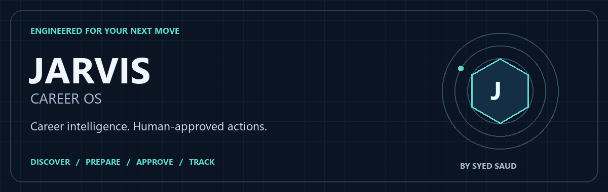
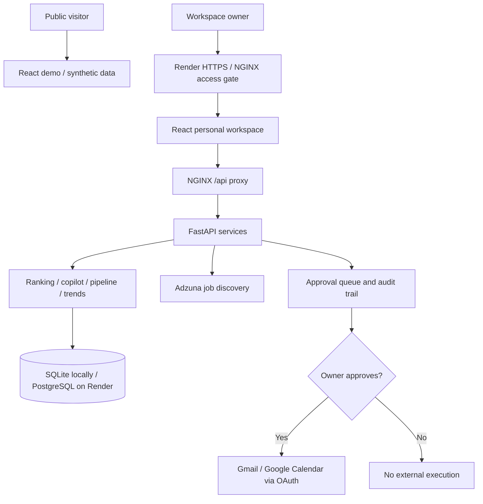

<p align="center">
  
</p>

<h1 align="center">JARVIS Career OS</h1>

<p align="center"><strong>Career intelligence. Explainable decisions. Human-approved actions.</strong></p>

<p align="center">
  <a href="https://jarvis-career-os.onrender.com/demo">Explore live demo ↗</a> &nbsp; · &nbsp;
  <a href="#architecture">Architecture</a> &nbsp; · &nbsp;
  <a href="#local-development">Quick start</a> &nbsp; · &nbsp;
  <a href="#quality-and-verification">Engineering quality</a>
</p>

<p align="center">
  
  
  
  
  
  
  
  
  
</p>

<p align="center"><sub>Original repository-owned artwork · brief intro animation, then still · <a href="docs/assets/career-os-banner.png">Static banner</a></sub></p>

---

A full-stack career workspace connecting job discovery, resume evidence, application tracking and approval-gated Google actions. Built by **Syed Saud** as a deployed engineering portfolio and personal-use product.

**[Explore the public demo](https://jarvis-career-os.onrender.com/demo)** · **[Creator profile](https://github.com/syedsaud15)** · **[CI runs](https://github.com/syedsaud15/jarvis-career-os/actions)**

| Explainable intelligence | Controlled execution | Measurable progress |
| :--- | :--- | :--- |
| Resume evidence and transparent fit signals | Explicit approval before Google actions | Pipeline history, next actions and recovery |

> The public demo uses synthetic data. It does not send email, create calendar events or access private career APIs. The owner's workspace is separately protected. This project does not claim enterprise certification or multi-tenant SaaS readiness.

## Why this project exists

Job searching often becomes a collection of disconnected browser tabs, resume drafts, spreadsheets and reminders. JARVIS connects those activities into a traceable workflow:

**Discover → compare evidence → capture → prepare → approve → track progress.**

The goal is not indiscriminate auto-application. It is to make the next useful action clear while keeping real-world communication under the user's control.

## Product experience

**One workspace. From discovery to the next decision.**

| Workspace | Capabilities |
| --- | --- |
| **Overview** | Market skill signals, high-fit radar, eight-week momentum and contextual next actions |
| **Opportunities** | Cached job discovery, fit explanations, quality scores, location/work-mode/experience/freshness/salary filters |
| **Pipeline** | Saved, applied, interview and rejected stages; notes, follow-ups and CSV export |
| **Application workspace** | Deterministic resume suggestions, cover-letter and recruiter-email drafts, interview preparation |
| **Action center** | Gmail and Calendar requests reviewed through an approval queue before execution |
| **Insights & settings** | Career preferences, skill-gap roadmap, weekly history, audit activity and private JSON backup |
| **Public showcase** | Architecture, technology overview, privacy boundaries and project disclaimer |

### Two experiences, separate data paths

| Capability | Public `/demo` | Protected `/` |
| --- | --- | --- |
| Data | Synthetic roles, profile and history | Owner's stored career data |
| Navigation and filters | Interactive | Interactive |
| Application preparation | Sample previews | Drafts based on captured roles and profile evidence |
| Uploads and persistent edits | Disabled | Available |
| Gmail / Calendar | No real integrations | OAuth connection and explicit approval required |
| Exports | Sample CSV | Personal CSV and career-data backup |

The repository is currently private. Source and CI links require authorized GitHub access; the demo is publicly accessible. The public showcase links to the creator's profile rather than promising access to private code.

## Architecture



Demo state comes from frontend fixtures rather than private API requests. Production NGINX exposes `/demo` while protecting the personal workspace and private API routes. A minimal health route is public for deployment checks.

### Engineering decisions

- **Deterministic assistance:** core ranking, drafts and preparation work without a paid LLM key; behavior is inspectable and regression-testable.
- **API-backed discovery:** job data comes from Adzuna rather than brittle browser scraping.
- **Shared ranking:** opportunities and radar use the same cached, deduplicated, ranked and age-filtered role selection.
- **Portable storage:** SQLite supports local development; PostgreSQL supports hosted persistence. Schema initialization and migrations live in the storage layer.
- **Approval before execution:** requesting an action is separate from executing it; decisions and outcomes are auditable.
- **Honest analytics:** saved roles, stage-change events and current-stage counts are distinct; unavailable history is never fabricated.
- **Recoverable data:** versioned exports can be restored into a new local database without overwriting production.

## Core workflow

1. **Add a resume.** Upload a text-based PDF or TXT file. The API extracts supported Data Engineering skills. With a hosted workspace, processing happens on the deployed server—not exclusively on the user's device.
2. **Search for roles.** For example: `find data engineer jobs in Pune`. Broaden the search location when exploring other Indian cities or remote roles.
3. **Review evidence.** Inspect matched skills, detected gaps and fit explanations. Filters operate on retrieved listings, not every job in India.
4. **Capture and prepare.** Open the application workspace, review drafts, record private notes and set follow-up dates.
5. **Track real progress.** Update stages when actual application/interview moves happen. Capturing a role does not submit an application.
6. **Review external actions.** Approve Gmail or Calendar requests before execution. Next-action shortcuts only navigate; they do not send or modify data automatically.
7. **Review and back up.** Use Insights for learning priorities, trends and a private career-data export.

## Local development

Requires an authorized checkout. The CI baseline is **Python 3.11** and **Node.js 22**. Keep development servers on loopback; this setup is not the production authentication boundary.

### Backend

From the repository root in PowerShell:

```powershell
python -m venv .venv
.\.venv\Scripts\Activate.ps1
python -m pip install -r requirements.txt
Copy-Item .env.example .env
```

Do not overwrite an existing `.env`. On macOS/Linux, use `source .venv/bin/activate` and `cp .env.example .env` instead.

For local SQLite, leave `DATABASE_URL` empty. Real discovery and Google actions require provider configuration; the synthetic demo does not.

```powershell
python -m uvicorn app.main:app --reload --host 127.0.0.1 --port 8000
```

### Frontend

In a second terminal, from the repository root:

```powershell
cd dashboard
npm ci
npm run dev -- --host 127.0.0.1
```

Open the URL printed by Vite, or append `/demo` for synthetic data. Vite proxies `/api` to the backend and removes that prefix. Direct backend API documentation: `http://127.0.0.1:8000/docs`.

### Configuration reference

| Variable | Purpose |
| --- | --- |
| `JARVIS_DB_PATH` | Local SQLite file; default `data/jarvis.db` |
| `DATABASE_URL` | PostgreSQL connection string; empty selects SQLite |
| `ADZUNA_APP_ID`, `ADZUNA_APP_KEY`, `ADZUNA_COUNTRY` | Job provider configuration; country defaults to `in` |
| `GOOGLE_CLIENT_ID`, `GOOGLE_CLIENT_SECRET`, `GOOGLE_REDIRECT_URI` | Gmail/Calendar OAuth application configuration |
| `JARVIS_API_KEY` | Server-side API protection; production proxy injects the key |
| `JARVIS_ADMIN_USER`, `JARVIS_ADMIN_PASSWORD` | Required Render container access gate |
| `JARVIS_TIMEZONE` | Workspace timezone; weekly trend buckets explicitly use UTC |

Use `.env` locally and deployment environment settings in production. Never place secrets in React source, screenshots or commits. Render uses `JARVIS_ADMIN_PASSWORD`; the separate Caddy/VPS setup uses `JARVIS_ADMIN_PASSWORD_HASH`. These settings are not interchangeable.

Optional LLM and bridge settings remain in [.env.example](.env.example); they are not required for the core career copilot. No paid LLM dependency is required, but third-party quotas, hosting limits and provider terms still apply.

## Deployment and access boundary

The Render path is defined in [render.yaml](render.yaml), [Dockerfile](Dockerfile), [NGINX configuration](deploy/render-nginx.conf) and [startup script](deploy/render-start.sh).

1. Configure required service environment values, including admin credentials, API key and durable PostgreSQL storage.
2. Add provider credentials only for enabled integrations. Match the deployed Google callback URI in both Google configuration and service settings.
3. Deploy the intended revision and check `/api/health`.
4. Check `/demo` without credentials and ensure `/` and private API routes reject unauthenticated access.
5. Confirm both CI and Render refer to the intended revision. The blueprint deploys on commits; deployment success alone does not prove CI passed.

Do not rely on a container's ephemeral filesystem for durable hosted data. See [DEPLOYMENT.md](DEPLOYMENT.md) for deployment notes and the separate Caddy/VPS path, and [PRODUCTION_CHECKLIST.md](PRODUCTION_CHECKLIST.md) for operational considerations.

## Quality and verification

| CI job | Coverage |
| --- | --- |
| `backend` | Unit/HTTP workflows, dedicated PostgreSQL service and export/restore verification |
| `dashboard` | ESLint and production frontend build |
| `browser-workflows` | Chromium desktop/mobile workflows, navigation, filters, copilot, keyboard, exports, action shortcuts and demo API isolation |
| `production-container` | Docker build and actual NGINX public/private authentication-boundary checks |

Backend checks, from the repository root:

```powershell
python -m pytest -q
```

Frontend checks:

```powershell
cd dashboard
npm run lint
npm run build
npx playwright install chromium
npm run test:e2e
```

Browser tests launch an isolated loopback server with synthetic data, not production Google actions. PostgreSQL recovery tests require a dedicated `JARVIS_TEST_DATABASE_URL`; never point it at production.

For restricted Windows environments, `python -m scripts.verify_local` provides a workspace-local temporary-directory fallback. `npm run build -- --configLoader native` avoids the default Vite configuration-loader subprocess. If browser workers fail with `spawn EPERM`, rely on the CI browser result; a blocked run is not a passing test.

Automated axe checks cover selected WCAG Level-A rules alongside keyboard and responsive checks. They do not establish full WCAG compliance or independent security certification. [FINAL_QA.md](FINAL_QA.md) records the procedure and earlier checkpoint evidence; the latest CI run is the reference for the current revision.

## Backup and recovery

Choose **Insights & settings → Download career backup** in the authenticated workspace.

**Included:** captured jobs, resume/profile, preferences, notes, follow-ups, resume versions and recorded application stage history.

**Excluded:** passwords, Google OAuth tokens, pending approvals, unrelated action history and uncaptured job cache.

> Credential-excluding does not mean non-sensitive. The JSON contains personal resume and career data. Keep it outside the repository and public folders, with a separate private copy.

Export from the repository root using the intended configured database:

```powershell
python -m scripts.export_backup --output career-backup.json
```

Restore into a **new local SQLite file**:

```powershell
python -m scripts.restore_backup career-backup.json --destination restored-career.db
```

Restore refuses an existing destination and rejects version-1 exports. It is not a production PostgreSQL overwrite tool or a full infrastructure backup. Google connections must be re-established separately. Preserve the original backup while validating recovery.

## Repository map

```text
app/
  main.py             API routes and career workflows
  job_ranking.py      Skill extraction, fit, quality and age heuristics
  approvals.py        Approval lifecycle
  google_actions.py   Google action execution
  store.py            Persistence and schema migrations
  trends.py           UTC calendar-week history
  backup.py           Versioned export and local restore
  agents/             Optional command-routing capabilities
dashboard/
  src/                React workspace, demo fixtures and UI components
  e2e/                Browser workflow and accessibility checks
deploy/               Render proxy and startup configuration
scripts/              Export, restore, QA and access-boundary tools
tests/                Backend unit, integration and recovery tests
.github/workflows/    Continuous integration
```

Optional WhatsApp bridge, expense and reminder command modules are separate from the main career experience. They are not required for the public demo or the hosted web workflow.

## Boundaries and known limitations

- **Fit is a heuristic, not a hiring probability.** Title, skills, employer signals, salary availability and freshness contribute. Quality scores measure metadata signals, not verified employer quality.
- **Skill extraction is bounded.** Supported Data Engineering vocabulary and text matching can miss requirements. Scanned/image-only resumes are not an OCR workflow.
- **Expiration is age-based.** Old listings are filtered heuristically; the system does not independently confirm whether an employer closed a role.
- **Discovery is not exhaustive.** Results depend on provider responses and cache. Verify salary, work mode and availability against the original listing.
- **Drafts need human review.** Generated wording is not evidence of a candidate's skills and does not mean an application was submitted.
- **History begins with recorded events.** Earlier stage transitions cannot be reconstructed. Current-week data is partial; repeat transitions count separately. Interview rate is a current-stage ratio, not historical conversion.
- **Operational maturity has limits.** Load testing, independent security review, comprehensive accessibility auditing, distributed rate limiting and verified multi-tenant isolation are not claimed by this personal-use release.

## About

Created by **[Syed Saud](https://github.com/syedsaud15)** to demonstrate full-stack product development, explainable career assistance, integration boundaries, relational persistence, recovery tooling and automated verification.

JARVIS Career OS uses an original vector intelligence-core mark and a career-focused interface. It is independent and has no affiliation with Marvel, Iron Man, employers or job platforms. Independently verify all job availability, salary information and fit signals.

No open-source license is currently declared in this repository. Public demo access does not itself grant permission to redistribute the source.
